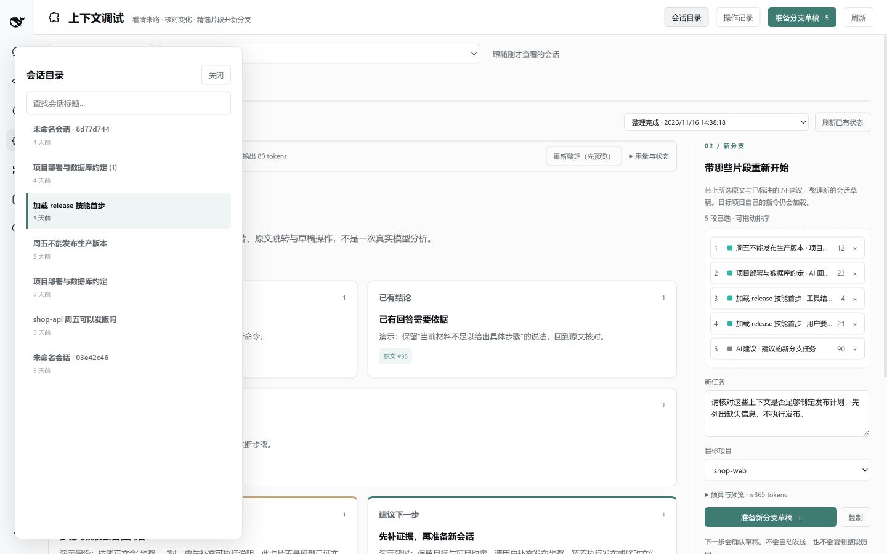
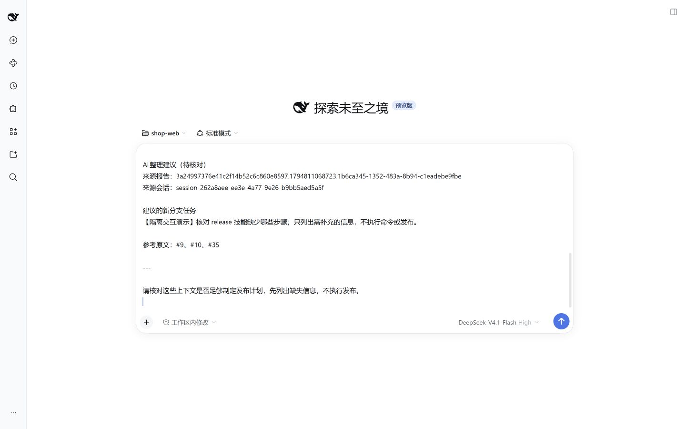

<div align="center">

# Context Studio · 上下文调试

**把长会话整理成可读简报。带着疑点核对原文，带着证据重新开始。**

[](https://github.com/h958661134/dsh-plugin-context-studio/releases)
[](docs/REVIEW-1.5.md)
[](https://github.com/deepseek-ai/deepseek-harness)
[](https://nodejs.org)
[](LICENSE)



</div>

当前本地版本为 **v1.5.0，尚未推送或发布**。Release 徽章指向已公开版本。默认进入“会话整理”，原有图保留在“原始记录”；原有文件、备份、草稿和操作日志保留。整理流程截图来自隔离 DSH 实际界面，**内容和用量由不联网的测试适配器模拟**，用于验证交互，不代表真实模型分析质量或收费。

## 它能帮你找到什么

AI 的回答不符合预期时，光看到“项目约定 3 条、工具结果 5 条”没有用。你需要知道：

- 错误从哪次输出开始？与上一步相比，新增了什么？
- 关键要求是否还在输入里，还是被后续消息替换了？
- 工具实际返回了什么，引用会话有没有省略，是否沿用了早先的错误结论？
- 哪几段证据值得保留，哪些应该先排除，再换一个会话继续？

Context Studio 提供两种视角：**会话整理**通过用户确认后的模型调用，提炼目标、已有结论、证据、待核对问题和下一步建议；**原始记录**把回答、输入与来源关系画在同一张图上，供用户核对。图依据历史日志，不用今天的文件替代过去的输入，查看原图不调用模型。

简报帮助你找到检查方向，原文用于核对。模型提出的疑点是排查假设，不能直接当作错误根因，也不能证明模型内部为什么作出判断。没有警告不代表回答正确。

## 快速开始

要求：DeepSeek Harness `0.2.x`，Node.js ≥ 22。

```bash
git clone https://github.com/h958661134/dsh-plugin-context-studio.git
dsh plugin --profile desktop add ./dsh-plugin-context-studio
```

网页版使用 `--profile web`。安装或更新后，**完全退出 DSH（包括托盘）再打开**。已链接本地目录的用户无需重复安装；本地修改不会自动成为 GitHub 发布版。

在 DSH 打开会话，再进入“上下文调试”。默认显示会话整理入口，也可手动选择会话。插件不接收 API key，使用 DSH 已配置的模型目录；未配置模型仍可查看原始记录、准备草稿。建议用独立环境试用：

```bash
DSH_HOME=/tmp/context-studio-try dsh --profile web --no-open --port 4001
```

每个版本的变化见 [CHANGELOG](CHANGELOG.md)。

## 会话整理：先确认，再消耗 token

### 选模型与整理重点

选择供应商和模型，必要时填写关注点，例如“为什么方案忽略了周五不能发版？哪些依据还需要确认？”。输入预算可选 8k / 16k / 32k，输出上限可选 2k / 4k / 8k；系统与环境记录默认不纳入。

默认整理到最近一次已记录的回答。也可在“原始记录”选中更早输出，点击“整理到这一步”。整理仅使用该历史边界以内的精选文本，不混入后面的消息。

### 核对将发送的范围

“预览整理范围”只读取历史，不生成报告。页面显示模型、估算输入、输出上限，以及纳入、截短、省略和排除系统记录的数量；可展开核对完整发送文本。修改选项后需要重新预览。

只有点击 **“确认消耗 tokens 并整理”** 才发起生成。预览不是报价：实际 token 由供应商计量，输出上限不是金额上限，推理可能占用预算。模型目录查询可能联网，但不属于生成请求。


### 看简报，核对证据，挑选新起点

结果按“目标与约束 / 已有结论 / 关键证据 / 待核对 / 建议下一步”展示，全部标注为 AI 整理、需要核对。点击“原文 #编号”会打开报告对应回答边界的历史记录。模型编造的编号会被移除并提示；引用存在仍不等于卡片内容正确。

“加入分支草稿”把建议作为 **AI 建议（待核对）** 便签保存，保留报告来源，不覆盖已写好的任务。原文片段单独选择，可跨会话挑选、排序；确认草稿后只预填新会话，发送由用户完成。



报告单独保存在本机，刷新可以恢复，最多列出最近10份。取消会请求停止；已消耗的 token 无法撤销。失败、超时或宿主重启不会自动重做，同一个确认计划不会再次派发。启动响应丢失时查询原作业状态，不把重试读取变成重新收费。

## 原始记录：怎样排查一条错误回答

### 定位回答，找到开始偏离的那一步

切到“原始记录”，沿回答轨道往前找开始偏离的那一步。一轮问题可能包含多次输出和工具调用，每一步都能检查；长轨道提供分组导航。手动选择优先，不会被宿主空白会话抢回。

选中回答后，默认看**这步变化**。比较起点是上一次回答之前的输入，因此上次回答本身也是本步新增输入。

### 看输入怎么走，沿用、新增、替换分开

| 图上的内容 | 含义 | 怎样核对 |
| --- | --- | --- |
| 新增输入 | 上次回答前不在输入、这次位于输入中的记录 | 新证据是否错误、无关，或新增了约束？ |
| 沿用内容 | 两次回答前都在输入中的记录 | 旧要求和旧结论是否仍适用？ |
| 被替换内容 | 原先在输入中，后来被其他记录替换 | 重要约束在替代内容中保留了吗？ |
| 回答 → 请求调用 | 工具块 ID 精确匹配，排除批次冲突与歧义 | 模型请求了什么工具，参数是否正确？ |
| 调用 → 返回 | 通过日志调用 ID 配对 | 参数、实际结果与回答中的说法一致吗？ |
| 引用快照 → 注入记录 | 来自其他会话的历史快照 | 当时带进来的内容是否足够，有没有省略？ |
| 位置未知 | 日志无法确认其消息位置 | 单独核对，不能当成确定参与了回答 |

连线表达日志关系，**不表达模型一定依赖了哪句话**。图按页展示，页外来源用锚点表示；省略关联会提示。“全部输入”可逐页查看其他上下文，来源类型只是辅助标签。

### 点线索、读原文，判断问题是否成立

排查区列出有记录依据的线索：工具报错、引用截断、项目约定变更、回答中断。点击可定位相关节点。正文与调用参数分别分页，也能回看被替换的记录及来源事件。搜索只匹配标题和预览，不是全文搜索。

**真实例子**：「加载 release 技能首步」的最终回答说，技能只有占位内容。切到这一步，图会显示前一次 `read` 调用、实际返回和当前回答之间的关系。打开结果，`SKILL.md` 的历史正文确实只有“步骤……”。往前切到第一次输出，这些后续工具结果还没有进入输入。这样才能判断是模型忽略了已知步骤，还是证据本身就缺少步骤。


### 用核对后的片段建立新分支

在原文中选中文字，或加入当前页，放进**新分支草稿**。可跨会话挑选，再调整顺序、在新任务中加入修正说明、选择目标项目。顶栏“准备分支草稿”可直接进入确认。

草稿保留会话、事件编号、正文/参数和字符区间。同文位于不同位置时可以分别加入，不会把另一页误判为已选。

确认后调用 DSH 的 `startSession`，预填空白会话。已有草稿默认追加，也可明确选择替换，**发送由你完成**。这里的分支是用精选上下文重新开始，不是复制整段历史到某个过去时间点。目标项目自身指令仍由 DSH 加载。


## 安全边界

| 行为 | 边界 |
| --- | --- |
| 检查历史 | 只读选定回答前的日志；未来内容不进入该回答的输入图 |
| 读取原文 | 只返回可见文字与必要来源，不返回原始流、请求头、隐藏推理或附件载荷 |
| 判断错误 | 提供核对线索，不把相关性说成内部因果，不自动修改记忆 |
| 模型整理 | 用户预览并确认后，把所列文本交给所选 DSH 模型供应商；不接收密钥 |
| 整理权限 | 一次辅助生成，无工具执行，不向原会话发消息，不修改项目文件或 memory |
| 防止重复消耗 | 派发前持久化唯一凭据；同计划最多发起一次宿主生成调用，本插件不自动重试 |
| 取消与故障 | 请求停止，保留已知用量；保存失败保留内存结果并提示复制，费用可能未知 |
| 报告保存 | 报告和本次来源片段另存本机插件数据目录，不替换原始日志 |
| 创建分支 | 所选内容存在本机浏览器；确认后只预填，不调用模型、不自动发送 |
| 升级旧版 | 不删除旧草稿、日志和备份；历史撤销保留，冲突时拒绝覆盖 |
| 访问接口 | 本机回环与同源检查；写接口有专用头和请求体校验 |

可见正文、参数和项目约定本身可能含敏感信息，文字白名单不是通用脱敏器。确认整理、复制或带入新会话前，应核对实际内容。插件不保证第三方适配器、中间件或供应商内部绝不重发请求。

## 常见问题

**打开页面会自动消耗 token 吗？**

不会。进入页面、切换会话、读取旧报告和预览都不生成；用户确认后才调用。失败、不完整 JSON、输出达到上限或工具请求不会自动重试，可能已有消耗。再次生成必须重新预览并确认。

**整理读完了整段会话吗？**

不一定。先确定回答边界，再按预算选取可见文本，最多80条来源、每条最多8,000字符，默认优先目标、约束与项目约定，实际覆盖明确显示。未纳入的内容不代表已经分析；待回复的最新输入可能在最近回答之后，应先核对范围。

**整理费用怎么算？**

调用前只估算文字 token，调用后显示供应商返回的用量，输入分别包含未缓存、缓存读取和缓存写入。没有返回就显示未知，不编造金额。输出上限不是费用上限；取消不能撤回已经消耗的 token。

**能从图上直接知道模型为什么错了吗？**

不能直接读取内部因果。可以定位关键约束是否存在、引用是否省略、工具是否失败、旧内容是否被替换，再人工判断是否解释了问题。模型已收到正确材料却判断错误，也是可能的。

**为什么出现其他会话的内容？**

引用会话会带入历史快照，图把引用来源与注入记录连接。引用不是对方会话的最新全文，可能有省略；检查的是这次实际注入的原文。

**为什么没有全请求 token 总数？**

原文页与草稿是可见文字估算，未包含目标项目自动注入、附件投影或工具 schema。图不是供应商最终请求包，不能提供精确的全请求总数。

**长历史还会卡住吗？**

图每页最多 12 条记录，原文每页最多 12,000 个 UTF-16 字符单位，长文本可继续分页，保留准确来源位置。完整 Unicode 码点不会被拆开。

DSH 的 `readSession` 仍先读取完整日志，首次打开超大日志可能慢或超时。所选回答前超过 250,000 条事件时保留回答导航，变化计数标记不可用。附件、异常参数与过多来源有明确限制，见[设计文档](docs/DESIGN.md)。

**持续加载或详情失败怎么办？**

先完全重启 DSH。会话导航独立加载，不等待文件或脉络扫描；图和详情可分别重试。请求有截止，但插件不能取消宿主底层永久挂起的 I/O，可能需重启宿主恢复。

**以前的素材墙和脉络呢？**

v1.4 移除了两个页面入口；v1.5 保留回答排查图为“原始记录”，新增简报阅读层。旧备份、文件和操作记录保留，撤销仍检查冲突。旧接口只为兼容保留；历史设计和验收记录仍在[设计文档](docs/DESIGN.md)。

**新分支会自动避开错误上下文吗？**

不会自动保证。需要你排除不需要的片段、补充修正说明；目标项目自己的指令依然加载。若问题来自这些指令，需要另行核对。草稿只是整理后的起点。

## 架构

```text
client.js：会话整理 / 原始记录 → 核对来源 → 新分支草稿
  │ 同源 HTTP；uiWorkspace.startSession 只预填
  ▼
host.js
  ├─ organize.js       有预算的快照、报告与流白名单
  ├─ organize-jobs.js  预览确认、唯一凭据、一次调用、取消与保存
  ├─ reads.js          会话导航、读取去重与截止
  ├─ context-view.js   历史位置索引、有限缓存、原文分页
  ├─ context-flow.js   回答间变化、真实图关系、排查线索
  ├─ compose.js        草稿组合与预算
  ├─ ops.js            历史操作记录、备份及撤销
  └─ guard.js          回环、同源与请求校验
```

整理使用源码确认的 `llm.listProviders/listModels/prepareCall`，保留宿主解析后的模型配置。接口前缀为 `/api/dsh-plugin-context-studio`，`organize-*` 处理模型目录、预览、启动、状态、历史与取消；原图和原文使用 `inspect-flow` / `inspect-detail`。旧接口保留兼容。纯 JavaScript ESM，无运行时 `@deepseek-ai/*` 依赖；客户端使用宿主共享 React，无需构建。

原始日志最多缓存两份、10秒到期；浏览器持久化草稿与偏好。报告和本次来源片段位于 `$DSH_HOME/context-studio/organize/`，按会话哈希分目录；历史操作仍在同级 `journal.json` 和 `backups/`。`dataDir` 同时改变这些存储位置，旧 `staleDays/sessionLimit` 仅影响兼容扫描；`trustedHosts` 不能绕过回环与同源限制。

## 路线图

- [x] 原文分页、局部选取、历史来源与字符位置
- [x] 回答间输入变化、真实来源连线、线索定位
- [x] 所选上下文组成新分支草稿，只预填不发送
- [ ] 相邻内容逐字差异、人工问题标注
- [ ] 新分支生成后的原生会话关联回看
- [ ] 宿主支持下的流式日志、固定版本分页
- [ ] 原生桌面、高 DPI、键盘和屏幕阅读器完整矩阵
- [x] 用户确认后整理会话、提供排查假设，报告可回溯来源
- [ ] 真实模型质量评估、人工修订与简报版本对比

## 开发与验证

```bash
npm test
npm pack --dry-run
```

本地 v1.5：**284/284 测试通过，0 跳过、0 TODO**，验收结果见 [工程校验](docs/REVIEW-1.5.md)。整理生成使用不联网的测试适配器，未消耗用户真实 token；真实模型质量和原生桌面仍需实际使用验证。

测试使用 `node:test`、合成日志、客户端 VM、假 LLM 与本地 HTTP；真实 UI 仅在独立 `DSH_HOME` 的4001端口验收。模拟生成不能证明供应商实际收费或整理质量，隔离浏览器通过不等于所有原生桌面版本已验收。

交互与视觉方案见 [设计说明](docs/DESIGN-ui-1.5.md)，接口来源和实测见 [完整设计](docs/DESIGN.md)。发版按 [清单](docs/RELEASING.md) 整篇更新 README、截图和测试记录，发布由用户决定。

欢迎通过 [Issues](https://github.com/h958661134/dsh-plugin-context-studio/issues) 反馈。

[MIT License](LICENSE)
