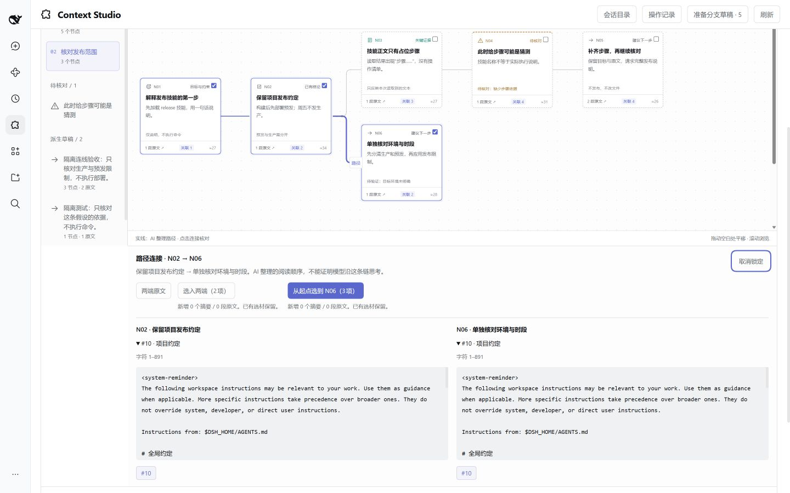
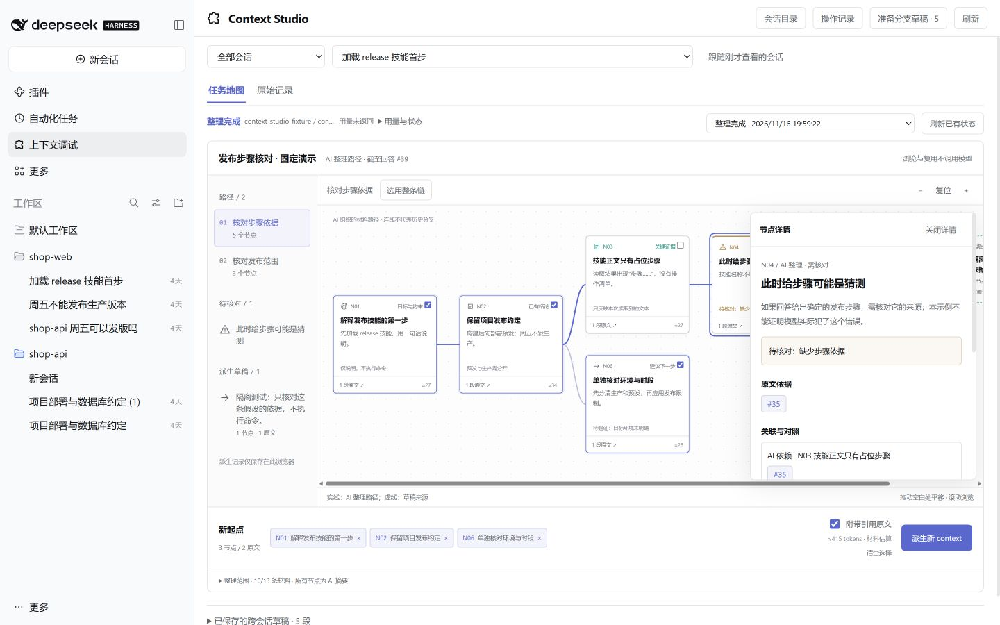
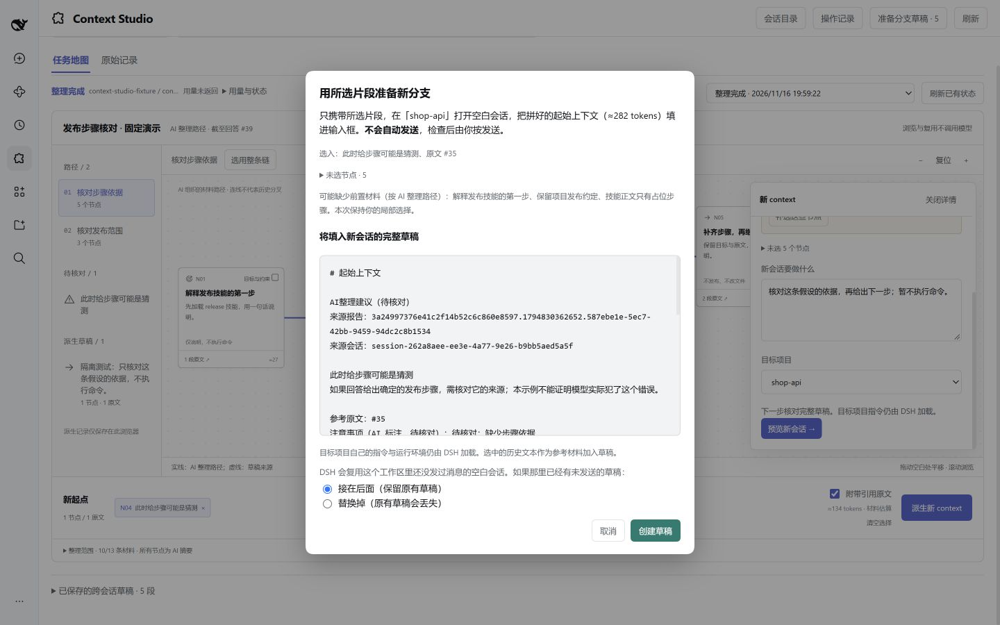
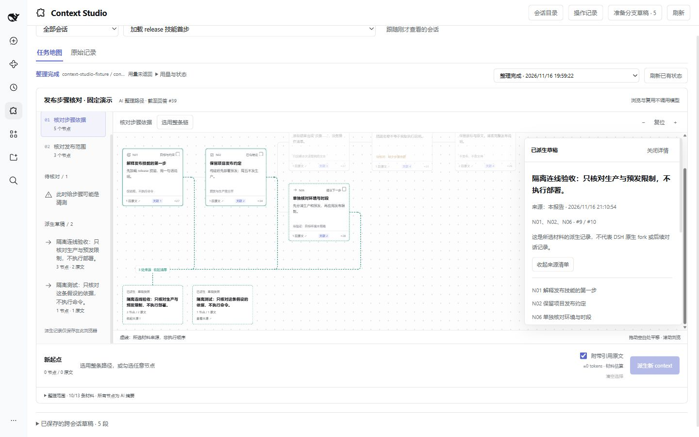
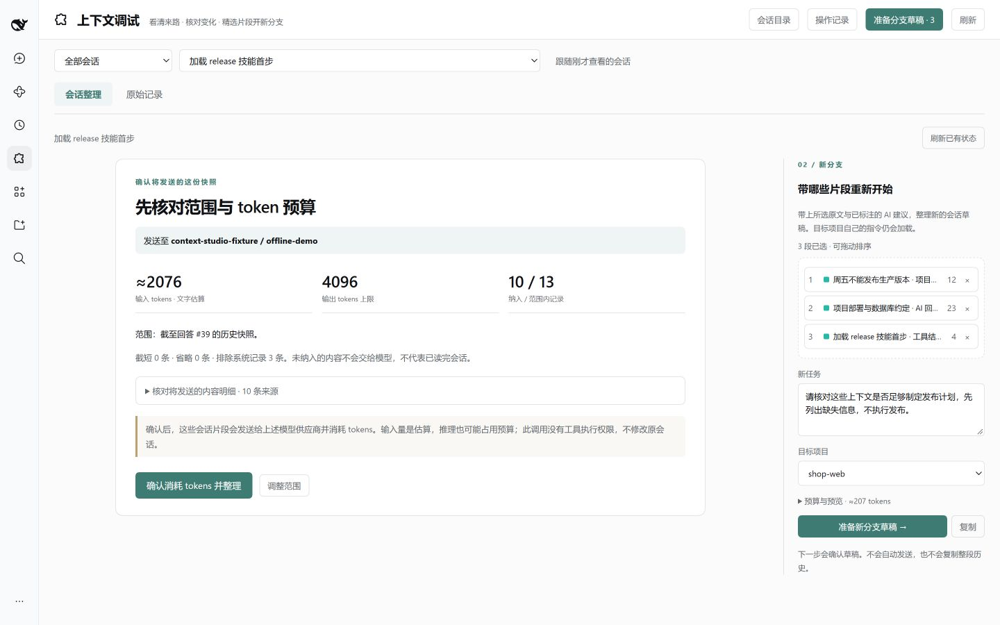
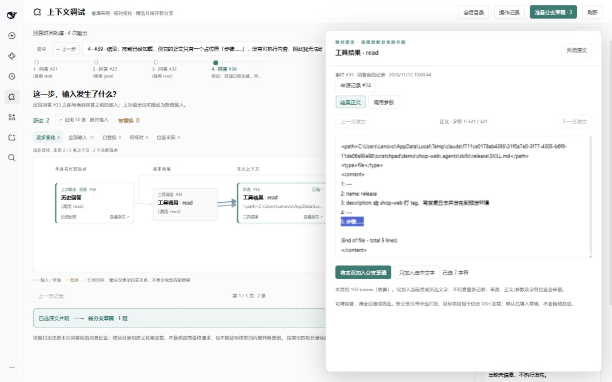
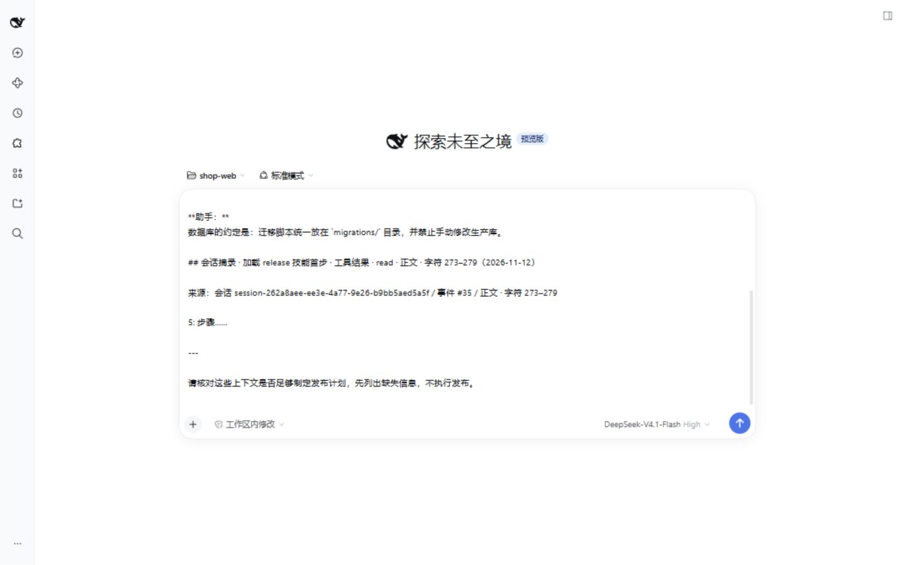

<div align="center">

# Context Studio · 上下文调试

**把整理过的会话变成分支图：核对每个判断的依据，选整条链或局部，组成新的 context。**

[](https://github.com/h958661134/dsh-plugin-context-studio/releases)
[](docs/REVIEW-1.8.md)
[](https://github.com/deepseek-ai/deepseek-harness)
[](https://nodejs.org)
[](LICENSE)


</div>

当前版本为 **[v1.8.0](https://github.com/h958661134/dsh-plugin-context-studio/releases/tag/v1.8.0)**。分支控制台新增分层连线：默认看整理路径，点击连接核对两端，分叉处先选方向；关联和派生来源只在查看时展开。旧报告继续免费查看；只有新报告明确提供的路径才可整链选用。本次包含 v1.2–v1.7 的本地开发成果，完整升级说明见 [Release](https://github.com/h958661134/dsh-plugin-context-studio/releases/tag/v1.8.0)。

本页地图截图来自隔离 DSH 的真实界面，**报告与关系是明确标注的固定模拟数据，本次没有调用模型**，用于验证交互，不代表真实分析质量或收费。原始记录、旧草稿、文件和备份保留。

## 它能帮你找到什么

AI 的回答不符合预期时，光看到“项目约定 3 条、工具结果 5 条”没有用。你需要知道：

- 错误从哪次输出开始？与上一步相比，新增了什么？
- 关键要求是否还在输入里，还是被后续消息替换了？
- 工具实际返回了什么，引用会话有没有省略，是否沿用了早先的错误结论？
- 哪几段证据值得保留，哪些应该先排除，再换一个会话继续？

Context Studio 提供两种视角：**任务地图**以分支控制台组织已整理的目标、已有结论、证据、待核对问题和下一步建议；**原始记录**把历史回答、输入与来源关系放在一起，供用户深入核对。首次整理需要用户确认模型调用；之后的看图、核对、选取和准备草稿都不再次生成。

简报帮助你找到检查方向，原文用于核对。模型提出的疑点是排查假设，不能直接当作错误根因，也不能证明模型内部为什么作出判断。没有警告不代表回答正确。

## 快速开始

要求：DeepSeek Harness `0.2.x`，Node.js ≥ 22。

从 [Release](https://github.com/h958661134/dsh-plugin-context-studio/releases/tag/v1.8.0) 下载 `dsh-plugin-context-studio-1.8.0.tgz`，在下载目录安装：

```bash
dsh plugin --profile desktop add ./dsh-plugin-context-studio-1.8.0.tgz
```

也可安装源码：

```bash
git clone https://github.com/h958661134/dsh-plugin-context-studio.git
dsh plugin --profile desktop add ./dsh-plugin-context-studio
```

网页版使用 `--profile web`。安装或更新后，**完全退出 DSH（包括托盘）再打开**。已链接本地源码目录的用户，更新该目录后重启即可，无需重复安装；本次开发目录已包含最新版本。

在 DSH 打开会话，再进入“上下文调试”。有成功报告时直接看地图；没有报告时，选择整理目的、模型，再预览范围。插件不接收 API key，使用 DSH 已配置的模型目录；未配置模型仍可查看原始记录和已有地图、准备草稿。建议用独立环境试用：

```bash
DSH_HOME=/tmp/context-studio-try dsh --profile web --no-open --port 4001
```

每个版本的变化见 [CHANGELOG](CHANGELOG.md)。

## 花过 token 之后：从分支图继续工作

### 先看路径，再看卡片

主界面是一张控制台：左侧是整理路径、待核对项和已派生草稿；中央画布显示共享起点与分叉；底部始终显示选材。拖动空白处可平移，工具栏可以缩放。点卡片才展开详情，关闭后回到画布。

卡片优先回答用户关心的问题：**这是什么结论、适用于哪里、有什么限制、依据在哪、带走大约多少文字**。短标题下显示摘要、适用范围或注意事项，底部有原文入口与 token 估算。`N01` 是本报告的节点编号，`#35` 是原始事件编号。所有卡片都是 AI 整理内容，证据类卡片也不是原文；点来源才能核对。

| 图上的连接 | 含义 |
| --- | --- |
| 实线与分叉 | AI 给出的阅读、核对路径；完整共享前缀合并，分歧后分别显示 |
| 打开草稿后的汇集虚线 | 这份本地草稿使用了哪些材料，详情列出完整来源；其他草稿的线收起 |
| 按需展开的关联线 | 一次核对一条 AI 标注的关联或共同引用；不会混入路径 |
| 独立节点 | 本报告没有把它放进路径，仍可查看与选用 |

**AI 整理路径不等于真实历史分支、执行顺序或模型内部思考。** 没有连线也不能证明彼此无关。历史事实仍在“原始记录”中核查。

旧报告直接打开，不补发模型调用。没有 `paths` 的报告保留卡片、按需关联和局部选材，不根据标题或排列编造整链。若想获取新的 AI 路径，需自行重新预览并确认整理；新模型也可能省略路径。

### 先读一条线，再决定是否带走

悬停连接可追看上游，点击后锁定两端，画布下方显示连接详情。共用段会标明“几条路径共用”；点分叉位置先选方向。查看、切方向、取消锁定和 Escape 都不会改变选材。

点 **“两端原文”** 并列核对证据。确认有用后，可以 **“选入两端”**，或 **“从起点选到这里”**。按钮旁提前显示实际新增摘要、原文数量；已有选择保留，“本次不带走”和已取消的原文不会被偷偷加回。

卡片上的“关联”入口可展开一条 AI 关系或共同引用，线从卡片外侧绕行。若同一摘要出现在多个分支，会先让你选择位置。关联自身的原文依据单独列出，不会被两端卡片引用代替。看完取消锁定即可回到路径，不会更改报告。



### 从疑点核对到原文

左侧“待核对”可定位卡片。详情显示完整摘要、适用范围、限制、相关节点和原文入口；点击 `#编号` 在图旁阅读当时保存的片段及字符范围。需要检查输入、工具调用或替换记录，再点“在原始记录中查看”，进入该报告的回答边界。



### 整链带走，或只拿一部分

1. **整链**：左侧选择路径，再点“选用整条链”。只选这条路径，不混入旁支。也可点具体卡片的“选用到这里”，只取共同起点到该节点。
2. **局部**：勾选任意卡片。查看节点或切换浏览路径不会替你改变选材。相同摘要出现在多个分支时，画布保留不同位置，最终材料按内容节点去重。
3. 在底部核对节点数、原文数与材料估算。默认附带有效引用原文，可以关闭或逐段取消。“本次不带走”只影响当前选材，可恢复；整链选择也尊重已排除项。
4. 点 **“派生新 context”**。面板列出已选/未选材料；若所选路径缺前置节点，或缺 AI 标注的依赖，会提示具体缺项。可点“补选这些节点”，也可坚持局部选择，系统不自动添加。
5. 填写新任务、选择项目，点“预览新会话”。确认页显示完整草稿和可能缺项；AI 摘要保留适用范围、限制与状态标注，原文保留会话、事件、字符位置。
6. 点“创建草稿”后只预填 DSH 输入框，**不自动发送**。已有草稿默认追加；替换需明确选择。目标项目自己的指令仍会由 DSH 加载。



未选节点的摘要不会加入，但同一原文可能被其他已选节点引用，务必核对全文。材料估算不含全部来源标签与任务说明，最终预览显示完整草稿的估算，仍不包含宿主之后自动注入的内容。

### 创建后能回来查来源

成功预填或确认复制后，左侧出现“派生草稿”，画布下方显示最近3份派生快照，打开较早记录时也会显示该份。默认收起来源线；打开一份时才将它的所选位置汇集到草稿，点来源清单核对摘要与原文。缺少位置记录时会提示，不猜测回连。打开可查看当时完整草稿，也可“恢复这份选材”重新编辑。这是来源快照，**不追踪新会话后续内容，也不是 DSH 原生 fork**。



派生快照包含选中内容，只保存在**当前浏览器**的 localStorage，最多20份、合计500,000个UTF-16单位，超出时淘汰最早记录；单份超限或存储失败会提示。存储失败不重试创建会话。网页与桌面不会自动共享这些记录；清除浏览器数据会丢失，不能当作永久备份。

尚未确认的选择仅临时记住最近6份报告，完整刷新后重置。已确认派生可从本地快照恢复；原有跨会话草稿独立保留。窄屏可用横向路径导航和覆盖式详情，外层页面不需要横向滚动：[900×800 实测](docs/images/edges-narrow.jpg)。

## 还没有结果：先确认，再消耗 token

### 选模型与整理重点

选择看全局、排查问题或准备接手，再选择供应商和模型。可以补充具体关注点，例如“为什么方案忽略了周五不能发版？”。高级选项提供输入预算 8k / 16k / 32k、输出上限 2k / 4k / 8k；系统与环境记录默认不纳入。

默认整理到最近一次已记录的回答。也可在“原始记录”选中更早输出，点击“整理到这一步”。整理仅使用该历史边界以内的精选文本，不混入后面的消息。

### 核对将发送的范围

“预览整理范围”只读取历史，不生成报告。页面显示模型、估算输入、输出上限，以及纳入、截短、省略和排除系统记录的数量；可展开核对完整发送文本。修改选项后需要重新预览。

只有点击 **“确认消耗 tokens 并整理”** 才发起生成。预览不是报价：实际 token 由供应商计量，输出上限不是金额上限，推理可能占用预算。模型目录查询可能联网，但不属于生成请求。



### 完成后回到地图，故障不会自动重做

结果自动显示为任务地图，报告单独保存在本机，刷新可以恢复，最多列出最近10份。默认优先显示进行中的整理，其次最近一次成功报告；最近的取消或失败不会把旧成功结果挡住，页面提供查看最近状态的入口。

“重新整理”在“用量与状态”中，需要重新预览和确认。取消会请求停止；已消耗的 token 无法撤销。失败、超时或宿主重启不会自动重做，同一个确认计划不会再次派发。启动响应丢失时查询原作业状态，不把重试读取变成重新收费。

## 原始记录：怎样排查一条错误回答

### 定位回答，找到开始偏离的那一步

切到“原始记录”，沿回答轨道往前找开始偏离的那一步。一轮问题可能包含多次输出和工具调用，每一步都能检查；长轨道提供分组导航。手动选择优先，不会被宿主空白会话抢回。

选中回答后，默认看**这步变化**。比较起点是上一次回答之前的输入，因此上次回答本身也是本步新增输入。

### 看输入怎么走，沿用、新增、替换分开

| 图上的内容 | 含义 | 怎样核对 |
| --- | --- | --- |
| 新增输入 | 上次回答前不在输入、这次位于输入中的记录 | 新证据是否错误、无关，或新增了约束？ |
| 沿用内容 | 两次回答前都在输入中的记录 | 旧要求和旧结论是否仍适用？ |
| 被替换内容 | 原先在输入中，后来被其他记录替换 | 重要约束在替代内容中保留了吗？ |
| 回答 → 请求调用 | 工具块 ID 精确匹配，排除批次冲突与歧义 | 模型请求了什么工具，参数是否正确？ |
| 调用 → 返回 | 通过日志调用 ID 配对 | 参数、实际结果与回答中的说法一致吗？ |
| 引用快照 → 注入记录 | 来自其他会话的历史快照 | 当时带进来的内容是否足够，有没有省略？ |
| 位置未知 | 日志无法确认其消息位置 | 单独核对，不能当成确定参与了回答 |

连线表达日志关系，**不表达模型一定依赖了哪句话**。图按页展示，页外来源用锚点表示；省略关联会提示。“全部输入”可逐页查看其他上下文，来源类型只是辅助标签。

### 点线索、读原文，判断问题是否成立

排查区列出有记录依据的线索：工具报错、引用截断、项目约定变更、回答中断。点击可定位相关节点。正文与调用参数分别分页，也能回看被替换的记录及来源事件。搜索只匹配标题和预览，不是全文搜索。

**真实例子**：「加载 release 技能首步」的最终回答说，技能只有占位内容。切到这一步，图会显示前一次 `read` 调用、实际返回和当前回答之间的关系。打开结果，`SKILL.md` 的历史正文确实只有“步骤……”。往前切到第一次输出，这些后续工具结果还没有进入输入。这样才能判断是模型忽略了已知步骤，还是证据本身就缺少步骤。



### 用核对后的片段建立新分支

在原文中选中文字，或加入当前页，放进**新分支草稿**。可跨会话挑选，再调整顺序、在新任务中加入修正说明、选择目标项目。顶栏“准备分支草稿”可直接进入确认。

草稿保留会话、事件编号、正文/参数和字符区间。同文位于不同位置时可以分别加入，不会把另一页误判为已选。

确认后调用 DSH 的 `startSession`，预填空白会话。已有草稿默认追加，也可明确选择替换，**发送由你完成**。这里的分支是用精选上下文重新开始，不是复制整段历史到某个过去时间点。目标项目自身指令仍由 DSH 加载。



## 安全边界

| 行为 | 边界 |
| --- | --- |
| 检查历史 | 只读选定回答前的日志；未来内容不进入该回答的输入图 |
| 读取原文 | 只返回可见文字与必要来源，不返回原始流、请求头、隐藏推理或附件载荷 |
| 判断错误 | 提供核对线索，不把相关性说成内部因果，不自动修改记忆 |
| 模型整理 | 用户预览并确认后，把所列文本交给所选 DSH 模型供应商；不接收密钥 |
| 整理权限 | 一次辅助生成，无工具执行，不向原会话发消息，不修改项目文件或 memory |
| OpenCode 路由 | 由 DSH 适配器携带独立的整理会话标识，同一来源会话保持稳定；不创建原生会话或注入额外历史 |
| 防止重复消耗 | 派发前持久化唯一凭据；同计划最多发起一次宿主生成调用，本插件不自动重试 |
| 取消与故障 | 请求停止，保留已知用量；保存失败保留内存结果并提示复制，费用可能未知 |
| 错误诊断 | 只保存固定错误分类、调用阶段与有限状态信息；不回显供应商原始错误、请求头或密钥 |
| 报告保存 | 报告和本次来源片段另存本机插件数据目录，不替换原始日志 |
| 地图关系 | 路径和状态只作 AI 标注；旧报告不补造路径，完整共享前缀才合并，历史事实另查原始记录 |
| 查看连线 | 共用段、分叉方向、关联和来源分层；仅查看不选材，歧义位置需明确定位 |
| 地图选取 | 查看不等于选入；临时排除可恢复，不删原文或 memory；不自动混入旧草稿 |
| 创建分支 | 所选内容存在本机浏览器；确认后只预填，不调用模型、不自动发送 |
| 派生快照 | 成功预填/复制后保存所选内容与来源；限本浏览器、限容量，不宣称是原生会话关联，不因保存失败重复创建 |
| 升级旧版 | 不删除旧草稿、日志和备份；历史撤销保留，冲突时拒绝覆盖 |
| 访问接口 | 本机回环与同源检查；写接口有专用头和请求体校验 |

可见正文、参数和项目约定本身可能含敏感信息，文字白名单不是通用脱敏器。确认整理、复制或带入新会话前，应核对实际内容。插件不保证第三方适配器、中间件或供应商内部绝不重发请求。

## 常见问题

**打开页面会自动消耗 token 吗？**

不会。进入页面、切换会话、读取旧报告和预览都不生成；用户确认后才调用。失败、不完整 JSON、输出达到上限或工具请求不会自动重试，可能已有消耗。再次生成必须重新预览并确认。

**之前已经整理过，要再花 token 才能看图吗？**

不用。旧报告直接在本地显示卡片，按需查看关联，可以核对和局部选材。没有明确路径时“选用整条链”不可用，不会根据排列猜路径或偷偷重新整理。看图和准备草稿不调用模型；用户之后在 DSH 发送草稿属于正常模型调用。

**为什么有些线默认看不到？**

默认只显示整理路径，避免关联和草稿来源互相遮挡。点卡片的“关联”后选择一条关系，或打开一份派生草稿，才会展开对应连线。共用干线需要先选方向；没有保存具体分支位置的旧草稿不会被猜测连线。

**为什么切换路径后，缺项提示没有跟着变？**

提示依据你实际勾选的分支位置，而不是当前正在浏览的路径。仅仅看另一条链不会更改选材。要改起点，可清空选择后重新勾选，或者显式选择另一条整链。

**“本次不带走”会删掉我的记忆吗？**

不会。它只改变当前报告的选材状态，节点还在，可以恢复。原始会话、报告、项目指令均不修改。

**整理读完了整段会话吗？**

不一定。先确定回答边界，再按预算选取可见文本，最多80条来源、每条最多8,000字符，默认优先目标、约束与项目约定，实际覆盖明确显示。未纳入的内容不代表已经分析；待回复的最新输入可能在最近回答之后，应先核对范围。

**普通会话能用，为什么“整理”却失败？**

v1.5 的辅助调用没有携带会话路由标识，会导致 OpenCode Go 缺少必需的 `x-opencode-session`。v1.5.1 对 `opencode-go` / `opencode` 使用稳定的独立整理标识，由 DSH 自身适配器生成请求头；其他供应商调用保持原样。[OpenCode 的会话要求](https://opencode.ai/docs/console/harnesses)

升级后完全退出 DSH（包括托盘）再打开。旧失败记录不会重跑或改变；如果决定再试，需**重新预览并确认消耗**。新失败会显示如 `AUTH`（权限）、`RATE_LIMIT`（限流）、`INVALID_REQUEST`（参数）等分类，作业文件还会区分模型准备、流响应和报告解析阶段。旧版仅保存通用错误时，无法从旧记录恢复供应商原始原因。即使用量显示0，也不能据此确认未收费。

**整理费用怎么算？**

调用前只估算文字 token，调用后显示供应商返回的用量，输入分别包含未缓存、缓存读取和缓存写入。没有返回就显示未知，不编造金额。输出上限不是费用上限；取消不能撤回已经消耗的 token。

**能从图上直接知道模型为什么错了吗？**

不能直接读取内部因果。可以定位关键约束是否存在、引用是否省略、工具是否失败、旧内容是否被替换，再人工判断是否解释了问题。模型已收到正确材料却判断错误，也是可能的。

**为什么出现其他会话的内容？**

引用会话会带入历史快照，图把引用来源与注入记录连接。引用不是对方会话的最新全文，可能有省略；检查的是这次实际注入的原文。

**为什么没有全请求 token 总数？**

原文页与草稿是可见文字估算，未包含目标项目自动注入、附件投影或工具 schema。图不是供应商最终请求包，不能提供精确的全请求总数。

**长历史还会卡住吗？**

图每页最多 12 条记录，原文每页最多 12,000 个 UTF-16 字符单位，长文本可继续分页，保留准确来源位置。完整 Unicode 码点不会被拆开。

DSH 的 `readSession` 仍先读取完整日志，首次打开超大日志可能慢或超时。所选回答前超过 250,000 条事件时保留回答导航，变化计数标记不可用。附件、异常参数与过多来源有明确限制，见[设计文档](docs/DESIGN.md)。

**持续加载或详情失败怎么办？**

先完全重启 DSH。会话导航独立加载，不等待文件或脉络扫描；图和详情可分别重试。请求有截止，但插件不能取消宿主底层永久挂起的 I/O，可能需重启宿主恢复。

**以前的素材墙和脉络呢？**

v1.4 移除了两个页面入口；v1.7 在任务地图内采用分支控制台，回答排查图保留为“原始记录”。旧备份、文件和操作记录保留，撤销仍检查冲突。旧接口只为兼容保留；历史设计和验收记录仍在[设计文档](docs/DESIGN.md)。

**新分支会自动避开错误上下文吗？**

不会自动保证。需要你排除不需要的片段、补充修正说明；目标项目自己的指令依然加载。若问题来自这些指令，需要另行核对。草稿只是整理后的起点。

## 架构

```text
client.js：分支控制台 / 原始记录 → 核对来源 → 整链或局部 → 完整草稿确认
  │ 同源 HTTP；uiWorkspace.startSession 只预填
  ▼
host.js
  ├─ organize.js       有预算的快照、报告/关系/路径校验、流白名单、安全错误分类
  ├─ organize-jobs.js  预览确认、唯一凭据、调用路由、取消与诊断保存
  ├─ reads.js          会话导航、读取去重与截止
  ├─ context-view.js   历史位置索引、有限缓存、原文分页
  ├─ context-flow.js   回答间变化、真实图关系、排查线索
  ├─ compose.js        草稿组合与预算
  ├─ ops.js            历史操作记录、备份及撤销
  └─ guard.js          回环、同源与请求校验
```

整理使用源码确认的 `llm.listProviders/listModels/prepareCall`，保留宿主解析后的模型配置。接口前缀为 `/api/dsh-plugin-context-studio`，`organize-*` 处理模型目录、预览、启动、状态、历史与取消；原图和原文使用 `inspect-flow` / `inspect-detail`。旧接口保留兼容。纯 JavaScript ESM，无运行时 `@deepseek-ai/*` 依赖；客户端使用宿主共享 React，无需构建。

原始日志最多缓存两份、10秒到期；浏览器持久化草稿与偏好。报告和本次来源片段位于 `$DSH_HOME/context-studio/organize/`，按会话哈希分目录；历史操作仍在同级 `journal.json` 和 `backups/`。`dataDir` 同时改变这些存储位置，旧 `staleDays/sessionLimit` 仅影响兼容扫描；`trustedHosts` 不能绕过回环与同源限制。

控制台使用同一坐标层的 SVG 连线与 HTML 卡片，路径公共段去重，关联和来源经卡片外侧通道走线，没有新增图形库、外部 CDN 或宿主接口。`report.relations` 按[关系契约](docs/REPORT-MAP-CONTRACT.md)校验，可选 `paths` 与卡片信息按[控制台契约](docs/REPORT-CONSOLE-CONTRACT.md)校验；旧文件不迁移、不补生成。路径按完整前缀建立实例树，选择保留实例位置，导出按卡片去重并保持选材顺序。

## 路线图

- [x] 原文分页、局部选取、历史来源与字符位置
- [x] 回答间输入变化、真实来源连线、线索定位
- [x] 所选上下文组成新分支草稿，只预填不发送
- [x] 已整理结果免费转图、节点依据联动、从所选材料准备新会话
- [x] Git 风格分支控制台、整链/局部选材、前置缺项提示
- [x] 画布平移缩放、本浏览器派生快照与恢复
- [x] 共用段与分叉交互、连接两端对照、按需关联和来源汇集
- [ ] 相邻内容逐字差异、人工问题标注
- [ ] 新分支生成后的原生会话关联回看
- [ ] 宿主支持下的流式日志、固定版本分页
- [ ] 原生桌面、高 DPI、键盘和屏幕阅读器完整矩阵
- [x] 用户确认后整理会话、提供排查假设，报告可回溯来源
- [ ] 真实模型质量评估、人工修订与简报版本对比
- [ ] 地图搜索、文字阅读替代、跨设备派生记录同步

## 开发与验证

```bash
npm test
npm pack --dry-run
```

v1.8.0：**427/427 测试通过，0失败、0跳过、0TODO**。自动化结果与独立审查记录见 [v1.8 工程校验](docs/REVIEW-1.8.md)。本轮开发验收未调用真实模型；真实供应商服务、路径质量和计费仍需用户确认后另行验证。

测试使用 `node:test`、合成日志、客户端 VM、假 LLM 与本地 HTTP；真实 UI 仅在独立 `DSH_HOME` 的4001端口验收。模拟生成不能证明供应商实际收费或整理质量，隔离浏览器通过不等于所有原生桌面版本已验收。

交互与视觉方案见 [设计说明](docs/DESIGN-ui-1.8.md)，接口来源和实测见 [完整设计](docs/DESIGN.md)。发版按 [清单](docs/RELEASING.md) 整篇更新 README、截图和测试记录，发布由用户决定。

欢迎通过 [Issues](https://github.com/h958661134/dsh-plugin-context-studio/issues) 反馈。

[MIT License](LICENSE)
